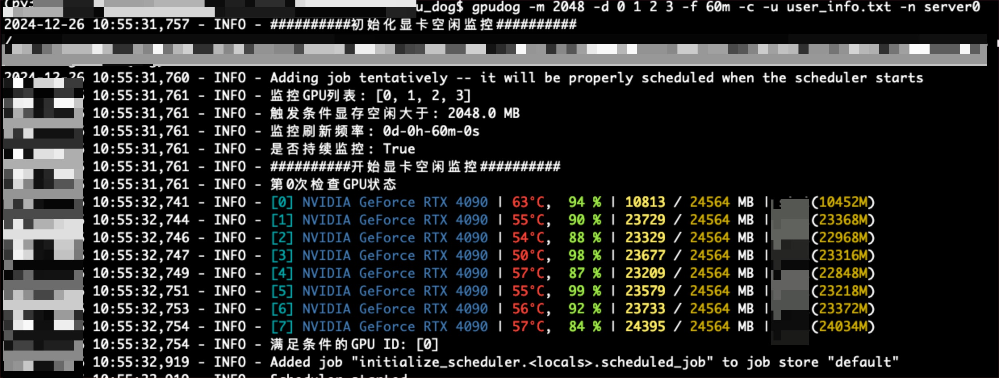
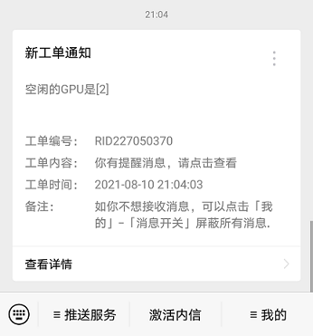
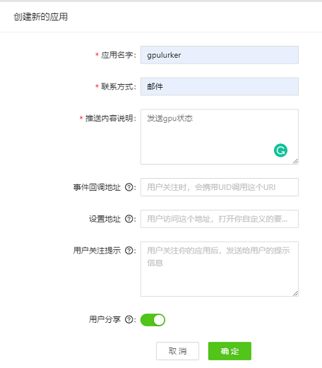
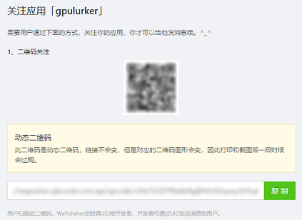

# gpu_dog


服务器 GPU 监控程序，当 GPU 属性满足预设条件 (如至少有 4 张卡且每张卡的显存多于 1000M) 时通过微信发送提示消息。

服务器上输入监控命令：
<p align="center">
  
</p>

满足条件后发送消息到微信：
<p align="center">
  
</p>

## 安装

从 PyPI 上安装:

```bash
python -m pip install -u gpudog
```

从 GitHub 上安装最新版本 (**推荐**):

```bash
python -m pip install git+https://github.com/lsrami/gpu_dog.git
```

或克隆该仓库手动安装:

```bash
git clone --depth=1 https://github.com/lsrami/gpu_dog.git
cd gpu_dog
python -m pip install -e ./
```

## 使用

### 一、在WxPusher微信推送服务上注册并且创建应用
1. 进入[https://wxpusher.zjiecode.com/admin/login](https://wxpusher.zjiecode.com/admin/login)，使用微信扫码关注「新消息服务」公众号并完善信息。

2. 创建新的应用，创建成功后请保存好显示的 **APP_TOKEN**
<p align="center">
  
</p>

3. 微信扫码关注应用
<p align="center">
  
</p>

4. 进入「新消息服务」公众号，点击「我的」-「我的UID」获取 **UID**


### 二、在服务器上输入命令进行 GPU 监控

```bash
# 每隔 60 分钟检查服务器状态，当0,1,2,3号卡空闲多余 2048M 时，向微信发送提示消息
gpudog -m 2048 -d 0 1 2 3 -f 60m -c -u ~/user_info.txt -n server0
```

首次使用时需要输入自己的 **UID** 和 **APP_TOKEN**。

#### 主要参数
键入 `gpudog --help` 以获得更多信息:
```
usage: gpudog [-h] [-m CUDA_MEMORY] [-d DEVICE_LIST [DEVICE_LIST ...]] [-f CHECK_FREQ] [-r] [-c] [-flag] [-p PROCESS_NAME] [-u USER_INFO] [-n NAME_SERVER]

检查GPU是否可用并通过微信通知

options:
  -h, --help            show this help message and exit
  -m CUDA_MEMORY, --cuda-memory CUDA_MEMORY
                        每个设备所需的CUDA内存（MB）
  -d DEVICE_LIST [DEVICE_LIST ...], --device-list DEVICE_LIST [DEVICE_LIST ...]
                        要使用的GPU ID列表
  -f CHECK_FREQ, --check-freq CHECK_FREQ
                        检查频率，例如10m（10分钟）
  -r, --reload          重新加载并更新您的appToken和uid
  -c, --continuous      条件满足时继续推送消息
  -flag, --flag-preempt
                        是否运行GPU抢占程序
  -p PROCESS_NAME, --process-name PROCESS_NAME
                        GPU抢占程序名称
  -u USER_INFO, --user-info USER_INFO
                        用户信息配置文件路径
  -n NAME_SERVER, --name-server NAME_SERVER
                        微信推送的名称
```

键入 `ctrl+c` 终止监控。


## 致谢
本项目基于gpu_lurker进行二次开发
- [gpu_lurker](https://github.com/RenShuhuai-Andy/gpu_lurker)

本项目参考了以下仓库的代码：
- [check_gpu_usage_and_forward_wechat](https://github.com/mzy97/check_gpu_usage_and_forward_wechat)
- [nvitop](https://github.com/XuehaiPan/nvitop)

微信消息实时推送服务由 [WxPusher](https://github.com/wxpusher/wxpusher-client) 提供。

## 许可证

GNU General Public License, version 3 (GPLv3)